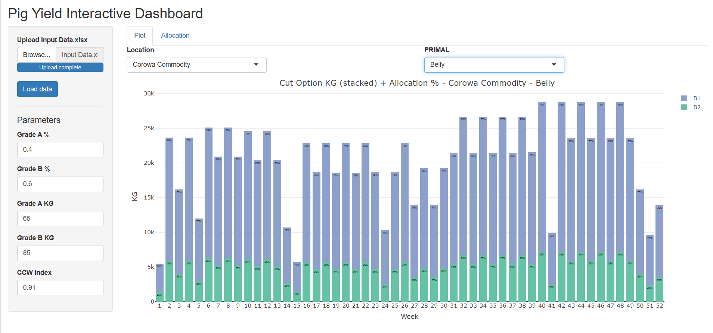
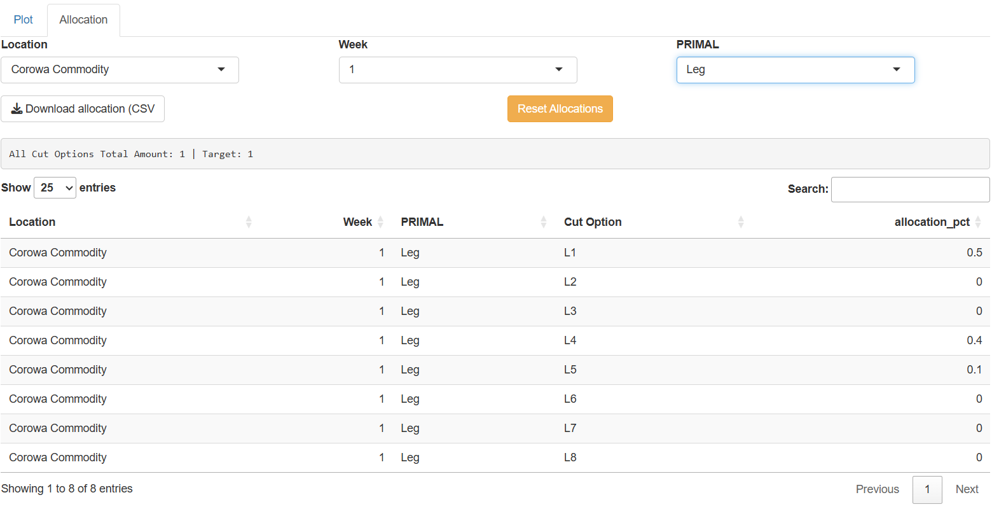

::: {.callout-note appearance="simple"}
This is a public write-up of a work project, so the real operational figures have been kept private. The screenshots below are from the live app to show the workflow; the underlying data is not shared.
:::

## The problem: "I just want to change a number and see the graph move"

My manager had a very reasonable ask. He wanted a tool where he could **change a few input numbers - the allocation of each cut - and immediately see how it changed the total product coming out**, broken down in a detailed graph.

That sounds like a job for Excel. But it isn't, really. Getting Excel to recalculate a *stacked, per-week, per-primal* breakdown and redraw it cleanly every time you nudge one number is either impossible or a huge, fragile amount of work in formulas and Power Query. The moment the shape of the data changed, it would break.

So instead of fighting Excel, I built a small **web app in R Shiny** that does exactly what he wanted - and put it online so he could use it from a browser, no code required.

🔗 **Live app:** [andytran78.shinyapps.io/Interactive_dashboard](https://andytran78.shinyapps.io/Interactive_dashboard/) *(upload the input workbook to populate it)*

## What it does

The manager uploads his Excel workbook, and the app turns it into an interactive dashboard with two tabs.

### 1. The plot - instant visual feedback



He picks a **Location** and a **PRIMAL** (e.g. Belly), and gets a stacked bar chart of the KG produced by each cut option, week by week, with the allocation percentage printed right on each segment. Hovering a bar reveals the exact product-level breakdown. The five parameters on the left (grade split, grade weights, CCW index) are live too - change one and the whole chart recomputes.

### 2. The allocation editor - change a number, see it flow through



This is the heart of the tool. He selects a Location, Week and PRIMAL, and gets an **editable table** of the allocation % for each cut option. He types a new number, and:

- the running total updates instantly (with a target check, so he can see when it adds up correctly);
- the plot on the other tab recomputes to reflect the new split;
- when he's happy, he clicks **Download allocation (CSV)** to export the new numbers;
- **Reset Allocations** puts the selected group back to the original values.

## How it works under the hood

### The yield calculation

Every pig produces a total sellable weight derived from the grade split and the CCW index. That total is then pushed through each cut's carcass yield and the manager's allocation to get the KG for each cut:

```r
# KG per pig, from the editable parameters
Total_KG <- (Grade_A_pct * Grade_A_KG * CCW_index) +
            (Grade_B_pct * Grade_B_KG * CCW_index)

# KG for each cut = pigs x carcass yield x allocation
final <- final %>%
  mutate(
    Total_KG_all = Total_KG * Pigs,
    cut_kg       = Total_KG_all * `Carcass Yield %` * allocation_pct
  )

# roll cuts up to primal level for the chart
primal_kg <- final %>%
  group_by(Location, Week, PRIMAL) %>%
  summarise(primal_kg = sum(cut_kg, na.rm = TRUE), .groups = "drop")
```

### Making it reactive

The trick that makes it feel "live" is Shiny's reactivity. The allocations live in a reactive value; the plot and the totals *depend* on it, so any edit automatically re-triggers everything downstream. The editable table writes each change straight back into that reactive value:

```r
# only the allocation column is editable
output$alloc_tbl <- renderDT({
  datatable(alloc_edit_slice(), rownames = FALSE,
            editable = list(target = "cell",
                            disable = list(columns = c(0, 1, 2, 3))))
})

# when a cell is edited, update the master allocation table
observeEvent(input$alloc_tbl_cell_edit, {
  info <- input$alloc_tbl_cell_edit
  df_all <- alloc_rv()
  idx <- which(df_all$Location == input$edit_Location &
               df_all$Week == as.integer(input$edit_Week) &
               df_all$PRIMAL == input$edit_PRIMAL &
               df_all$`Cut Option` == alloc_edit_slice()$`Cut Option`[info$row])
  df_all$allocation_pct[idx] <- as.numeric(info$value)
  alloc_rv(df_all)      # <- this one line makes the plot redraw itself
})
```

### Letting him take the result with him

Because the whole point was to *try scenarios*, exporting the edited allocation had to be one click:

```r
output$download_alloc <- downloadHandler(
  filename = function() paste0("Allocation_", Sys.Date(), ".csv"),
  content  = function(file) {
    alloc_rv() %>%
      select(Location, Week, `Cut Option`, allocation_pct) %>%
      readr::write_csv(file)
  }
)
```

## Challenges and what I learned

- **Reshaping messy input.** The workbook stores allocations in a wide, human-friendly layout; the app reshapes each sheet from wide to long so everything can be joined and computed cleanly.
- **Two allocation scales.** People enter allocations as either `0.25` or `25%`. I added a small detector so the totals and bar labels behave correctly either way, instead of forcing one convention on the user.
- **Keeping edits in sync.** The editable table only ever shows one slice, so edits had to be written back to the *full* dataset by key - not just the visible rows - or the plot would fall out of sync.
- **Shipping it.** Deploying to shinyapps.io meant the manager just needed a link, not R, to use the tool.

## The outcome

What used to be an impossible-in-Excel request became a live, shareable tool. My manager can now explore "what-if" allocation scenarios in near real time, see the impact across all 52 weeks and every primal, and export the result - turning a manual spreadsheet chore into an interactive decision-support app that a non-coder can drive.
