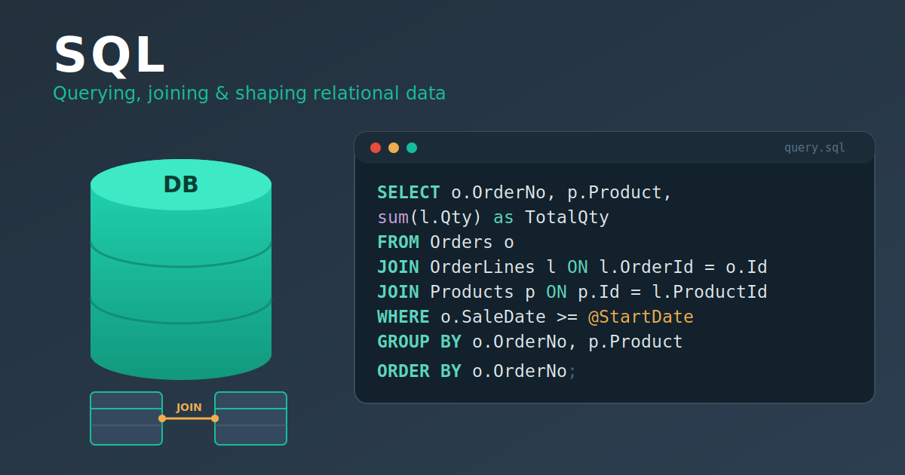

{fig-alt="SQL skill: a database, relational tables joined together, and a SQL query with SELECT, JOIN, WHERE and GROUP BY."}

::: {.callout-note appearance="simple"}
This is a public write-up of an internal reporting project. To protect the company, I've deliberately left out all sensitive details - database server names, connection strings, the real table/column schema, and business-specific logic. The SQL below is a **generic, invented example** that shows the *technique*, not the real query.
:::

## The idea: reports people can run themselves

A lot of business reporting still works like this: someone needs a number, so they ask an analyst, who writes or runs a query and sends back a spreadsheet. It works, but it doesn't scale - every question is a round trip.

I wanted to build the opposite: a **self-service report**. The analyst (me) writes and validates the SQL once; after that, anyone can open the report in the company's reporting tool, type in a few filters - a date range, a plant, a customer - and get exactly the slice of data they need, without ever seeing a line of SQL.

The first report I built this way was a **daily sales report** (for SOX compliance): a clean, one-row-per-order-line view of what was sold, to whom, where it was going, and what it was worth.

## Step 1 - Write and validate the SQL

The foundation is a single, fairly involved query. It joins the order, line, product, customer, currency and destination tables together and flattens them into one tidy row per order line. Along the way it does the unglamorous-but-essential work that makes a report trustworthy:

- **Currency conversion** - every sale value is converted from its order currency into AUD using the exchange rate *on the sale date*, while also keeping the original foreign-currency value.
- **Unit conversion** - order weights are converted into a single common unit (kilograms), regardless of the unit they were entered in.
- **Correct grain** - careful joins and de-duplication so the report is exactly one row per line, with no accidental fan-out.

While developing, I used `DECLARE` statements at the top to hard-code test values so I could run and check the query locally until the numbers were right:

```sql
-- During development: hard-code inputs to test the query locally
declare @StartDate date = '2026-05-06';
declare @EndDate   date = '2026-05-06';
declare @Plant     varchar(20) = '';

select
    o.OrderNumber,
    p.ProductCode,
    c.CustomerName,
    SaleValueAud = cast(l.NativeAmount * fx.Rate as decimal(18,2))
from      Orders      o
join      OrderLines  l on l.OrderId    = o.Id
join      Products    p on p.Id         = l.ProductId
join      Customers   c on c.Id         = o.CustomerId
where     o.SaleDate between @StartDate and @EndDate
  and     (@Plant = '' or o.Plant = @Plant);
```

*(All names above are invented placeholders - the real query is more involved and against a different schema.)*

## Step 2 - Rebuild it as a parameterised report

This is the part that makes it self-service, and the part I found most interesting. The company uses an **enterprise ERP reporting tool** (a grid-style report builder). Once my SQL returned the right table, I moved it into that tool and reshaped it into a report:

{fig-alt="Diagram showing a validated SQL query flowing into an ERP report tool where DECLAREs become parameters and result columns define a grid, producing a self-service report."}

1. **Paste the SQL** into the tool's SQL statement.
2. **Remove the `DECLARE` statements.** Those were only for local testing - the tool doesn't want hard-coded values.
3. **Recreate each `DECLARE` as a Parameter.** Every variable I'd hard-coded becomes a user input field: *Start Date*, *End Date*, *Plant*, *Customer*, *Product*, *Status*. At runtime the tool injects whatever the user types into the query in place of the old variables.
4. **Define the Result Columns** - the output structure: which columns appear, their labels, their data types, and their formatting (number masks, date formats). This is what turns a raw result set into a clean, readable grid.

The result: a report where a user picks a date range and a couple of filters, hits run, and gets the matching data table - powered by my SQL, but with none of its complexity exposed.

```sql
-- In the report tool, the DECLAREs are gone; the tool supplies the values from
-- the user's parameter inputs. The query body just references them:
where o.SaleDate between @StartDate and @EndDate
  and (@Plant    = '' or o.Plant       = @Plant)
  and (@Customer = '' or c.CustomerName like '%' + @Customer + '%')
```

## Doing it properly: the engineering around the SQL

The query is only half the work. To make this reliable and maintainable, I also:

- **Built a data dictionary.** Enterprise schemas are full of coded columns whose meaning isn't obvious (order *type* vs. domestic/export *flag*, product class codes, and so on). I confirmed each one against the database and recorded it - with *how* and *when* it was verified - so I (and anyone after me) can trust those meanings without re-querying every time.
- **Handled test-vs-production data gaps.** I built and validated the report in a test (UAT) environment where some master-data fields aren't populated yet. Rather than hide that, I documented each field as a known gap that's expected to fill in once it runs against production - so the joins are already correct and ready.
- **Documented every assumption.** Some definitions genuinely needed a manager's sign-off (which date counts as the official "sale" date, how a particular price should be defined). I flagged each one clearly in the code and spec as an open question rather than quietly guessing.

## Where it's heading

Right now the report lives inside the reporting tool. The bigger plan is to build a proper **UI / app on top of it**, so that anyone across the business can open a simple web page, choose their filters, and look up this information directly - turning a one-off analyst query into a genuine self-service tool that scales to the whole company.

## What I learned

- **A report is a product, not a query.** The SQL is the engine, but parameters, column formatting, documented assumptions and verified lookups are what make it something other people can actually trust and use.
- **Design for the next person.** The data dictionary and the documented gaps mean this report can be handed over, extended, or moved to production without someone having to reverse-engineer my thinking.
- **Self-service is a force multiplier.** Every filter I exposed as a parameter is a question the business can now answer on its own, instead of waiting on an analyst.
